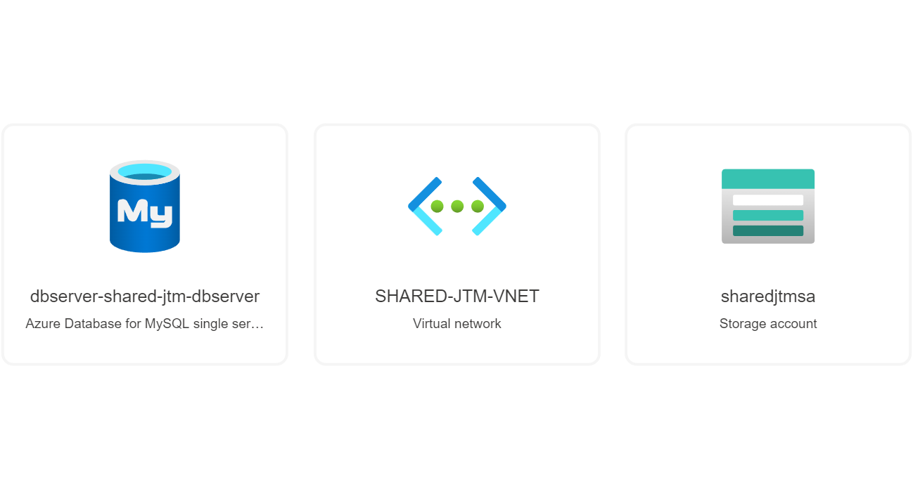

# Projet Terraform Azure

## Rappel du sujet

Le but de ce projet est de déployer une infrastructure sur Microsoft Azure à l'aide de Terraform et/ou Azure Resource Manager.

Le déploiement final doit correspondre au schéma suivant : 

Des contraintes sont à respecter :

- Un code "PROJECT" doit être établi, et il doit être composé de la première lettre du nom de famille de chaque membre du groupe.
- Un code "ENV" doit être utilisé pour chaque environnement : CORE, APP1, APP2. Chaque ressource doit être nommée avec ce code : {NOM}-{ENV}-{PROJECT}-{TYPE}

## Introduction

Pour ce projet, nous avons fait le choix d'utiliser exclusivement Terraform. Nous ne créons aucune ressource à la main, ni avec Azure Resource Manager.

Toutes les ressources qui sont déployés seront ainsi disponible sur ce repository.

### Membres du groupe

Les membre de notre groupe sont :

- Théo BARBOU
- Mathis DUGNACH
- Jérémie MAZOYER

## Prérequis

### Terraform

Le premier prérequis est de disposer de la ligne de commande Terraform.

La documentation d'installation est disponible ici : <https://developer.hashicorp.com/terraform/downloads>

### CLI Azure

Il est aussi nécessaire d'installer la ligne de commande pour Microsoft Azure.

Une documentation d'installation est disponible ici : <https://learn.microsoft.com/fr-fr/cli/azure/install-azure-cli>

Une fois installé, il faut exécuter la commande `azure-cli login` afin de se connecter à votre compte Azure, et de pouvoir utiliser la CLI.

## Déploiement

### Modification des variables Terraform

La première étape du déploiement est de vérifier que les variables qui sont définies soient les bonnes.

Une variable `project-code` est disponible, et elle vous permet de définir votre code "PROJECT".
Dans notre cas, la première lettre de nos prénoms définissent le code "JTM".

Une variable `location` vous permet de changer la région sur laquelle les ressources seront déployées.
Dans notre cas, nous avons fait le choix de déployer nos ressources sur la région "West Europe".

La variable `admin_username` vous permet de définir un nom d'utilisateur pour effectuer l'administration sur les ressources qui le permettent.

Enfin, la variable `admin_ssh_pubkey` vous permet de définir une clé SSH publique à utiliser pour effecteur l'administration des ressources qui le permettent.

### Lancement de Terraform

Une fois que toutes les variables ont bien étés modifiées, vous pouvez maintenant lancer le déploiement des ressources avec la commande `terraform apply`.

Terraform va alors calculer les ressources qui sont à créer et/ou à modifier, et il va vous présenter ce résultat. Si vous acceptez que ces ressources soient modifiées, vous pouvez alors écrire `yes` et continuer le déploiement.

Une fois le déploiement terminé, il nous reste plus qu'à modifier si tout fonctionne.

## Résultat final

### Vérification de l'état du déploiement

Pour vérifier si toutes les ressources ont étés créer, un des moyens possible est d'aller vérifier sur le portail Microsoft Azure à l'adresse <portail.azure.com>.

Si on va vérifier l'état des "Resource groups", on voit voir que les 4 groupes de ressources ont bien étés crées : .

Si on sélectionne un des Resource group, on peut voir que des ressource groups ont bien étés crées : 

### Test des applicatifs

Le moyen le plus pertinent de vérifier que notre déploiement a été réalisé correctement est de vérifier si les applications sont joignables.

Pour se faire il est nécessaire de récupérer l'addresse IP du Load Balancer.

En sélectionnant la ressource `ALB-CORE-JTM-PUBIP`, nous pouvons récupérer l'adresse IP publique du load balancer : 

Maintenant que nous avons l'adresse IP, nous pouvons vérifier que nos 2 applicatifs sont disponibles.

Le premier applicatif est bien disponible à l'adresse `http://20.93.138.101/app1` : 

Le second applicatif est bien disponible à l'adresse `http://20.93.138.101/app2` : 

### Schéma du déploiement

#### Résultat de la commande terraform graph

Schéma du déploiement obtenu avec la commande `terraform graph`, aussi disponible dans le dossier misc de ce repository :


#### Resultat obtenu avec la visualisation d'Azure

Resource Group CORE :


Resource Group SHARED :



Resource Group APP1 :


Resource Group APP2 :


## Problèmes rencontrés

Pendant la mise en place de ce projet, nous n'avons pas rencontré de difficulté particulière en dehors de celles qui se trouvent dans cette partie du document.

### Créer un template cloudinit pour démarrer Wordpress

Une des difficultés rencontrées a été de démarrer les VMs de l'APP1 avec Wordpress installé et configuré.

La solution que nous avons trouvés a été de démarrer les VMs avec un template cloudinit.

Lorsque nous démarrons les ressources `azurerm_linux_virtual_machine_scale_set`, nous ajoutons un paramètre `custom_data` qui nous permet d'exécuter un script au démarrage des instances.
Ce script est généré dynamiquement grâce à des variables présentes dans le fichier terraform :

```bash
  vars = {
    WORDPRESS_DB_HOST     = "${azurerm_mysql_server.shared-server.fqdn}"
    WORDPRESS_DB_USER     = "${var.admin_username}@${azurerm_mysql_server.shared-server.name}"
    WORDPRESS_DB_PASSWORD = "${random_password.db-secret.result}"
    WORDPRESS_DB_NAME     = "${azurerm_mysql_database.shared-db.name}"
    WP_HOME               = "http://${azurerm_public_ip.alb-pubip.ip_address}/app1"
    WP_SITEURL            = "http://${azurerm_public_ip.alb-pubip.ip_address}/app1"
  }
```

Ces variables permettent d'effecuter un template du fichier suivant :

```yml
#cloud-config
packages:
  - docker.io
runcmd:
  - sudo docker run --name wordpress -p 80:80 -e WORDPRESS_DB_HOST="${WORDPRESS_DB_HOST}" -e WORDPRESS_DB_USER="${WORDPRESS_DB_USER}" -e WORDPRESS_DB_PASSWORD="${WORDPRESS_DB_PASSWORD}" -e WORDPRESS_DB_NAME="${WORDPRESS_DB_NAME}" -e WORDPRESS_CONFIG_EXTRA="define('WP_HOME','${WP_HOME}');define('WP_SITEURL','${WP_SITEURL}');" -d wordpress:latest
  - sudo echo "test"
```

Ainsi, au démarrage des VMS, nous installons docker, et nous démarrons un container Wordpress avec les bonnes variables d'environnement afin que Wordpress fonctionne correctement au démarrage

### Changer le chemin d'accès de Wordpress

Une autre des difficultés est dans la lignée du problème précédent.
Une fois que nous avons démarrés Wordpress sur nos instances, nous étions redirigés automatiquement lorsqu'on essayit d'accéder à l'application au travers du Load Balancer.

Ce problème était du au fait que Wordpress ne savait pas quelle adresse IP publique il devait utiliser.

Pour solutionner ce projet, nous avons configuré les variables d'environnement `WP_HOME` et `WP_SITEURL`.

Dans notre cas, ces valeurs retournés vers le load balancer au chemin `/app1` tel que :

```text
WP_HOME               = "http://${azurerm_public_ip.alb-pubip.ip_address}/app1"
WP_SITEURL            = "http://${azurerm_public_ip.alb-pubip.ip_address}/app1"
```

### Accéder à l'app service avec une ip privée

Un problème sur lequel nous avons passé un temps considérable est sur l'accès de l'app service avec une IP privée dans le subnet APP2.

Dans le sujet, il est spécifié que le Load Balancer doit accéder à l'APP2 en passant par le subnet `app2-vnet`.

Le problème que nous avons rencontrés est qu'initialement, un App Service est configuré pour être accessible avec une adresse IP publique.

Pour résoudre ce problème, nous avons créé un Private Endpoint dans le subnet `app2-vnet`. Après création de ce Private Endpoint, l'application était effectivement disponible depuis ce subnet, mais elle n'était pas disponible depuis le subnet du Load Balancer.

Afin que le Load Balancer puisse accéder à APP2, nous avons du créer une zone DNS privée.

Après création de la zone DNS privée, et de la configuration d'un lien entre cette zone DNS privée entre le subnet du load balancer et le subnet `app2-vnet`, nous avons pu accéder à l'application depuis le Load Balancer.

### Générer les règles de firewall pour autoriser les applications à accéder à la BDD

Dans le même esprit que pour le problème précédent, il était difficile pour nous d'identifier quelle adresse IP utilisait l'App service (APP2) pour accéder à la base de données.

Afin de réduire au maximum les flux possibles vers la base de données, nous avons commencé par créer une règle de firewall qui accepte les flux depuis les services Azure, avec l'adresse `0.0.0.0`

À l'avenir, il serait possible d'utiliser un paramètre `possible_outbound_ip_addresses` pour créer les règles de pare-feu.

Dans nos tests, nous avons aussi utilisé ces ressources pour créer ces règles dynamiquement :

```terraform
locals {
  func_ips = distinct(flatten([split(",", azurerm_linux_web_app.app2_wordpress.possible_outbound_ip_addresses)])) # Get all possible outbound IP addresses from app service
}

resource "azurerm_mysql_firewall_rule" "app2-wordpress" {
  for_each = toset(local.func_ips)

  name                = "APP2-SHARED-${replace(each.value, ".", "_")}-${var.project-code}-FWRULE"
  resource_group_name = azurerm_resource_group.shared.name
  server_name         = azurerm_mysql_server.shared-server.name
  start_ip_address    = each.value
  end_ip_address      = each.value
}
```
