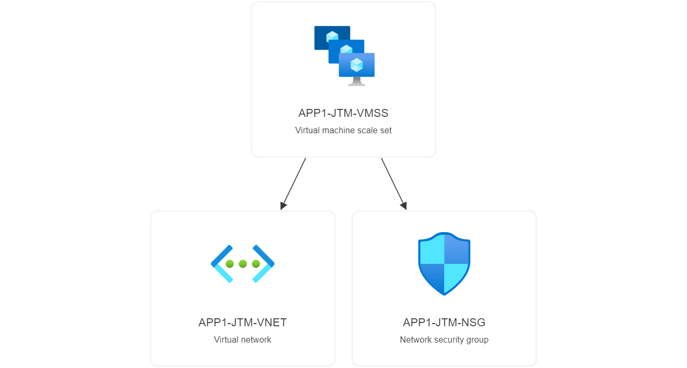

# Projet Terraform Azure

## Rappel du sujet

Le but de ce projet est de déployer une infrastructure sur Microsoft Azure à l'aide de Terraform et/ou Azure Resource Manager.

Le déploiement final doit correspondre au schéma suivant : 

Des contraintes sont à respecter :

- Un code "PROJECT" doit être établi, et il doit être composé de la première lettre du nom de famille de chaque membre du groupe.
- Un code "ENV" doit être utilisé pour chaque environnement : CORE, APP1, APP2. Chaque ressource doit être nommée avec ce code : {NOM}-{ENV}-{PROJECT}-{TYPE}

## Introduction

Pour ce projet, nous avons fait le choix d'utiliser exclusivement Terraform. Nous ne créons aucune ressource à la main, ni avec Azure Resource Manager.

Toutes les ressources qui sont déployés seront ainsi disponible sur ce repository.

### Membres du groupe

Les membre de notre groupe sont :

- Théo BARBOU
- Mathis DUGNACH
- Jérémie MAZOYER

## Prérequis

### Terraform

Le premier prérequis est de disposer de la ligne de commande Terraform.

La documentation d'installation est disponible ici : <https://developer.hashicorp.com/terraform/downloads>

### CLI Azure

Il est aussi nécessaire d'installer la ligne de commande pour Microsoft Azure.

Une documentation d'installation est disponible ici : <https://learn.microsoft.com/fr-fr/cli/azure/install-azure-cli>

Une fois installé, il faut exécuter la commande `azure-cli login` afin de se connecter à votre compte Azure, et de pouvoir utiliser la CLI.

## Déploiement

### Modification des variables Terraform

La première étape du déploiement est de vérifier que les variables qui sont définies soient les bonnes.

Une variable `project-code` est disponible, et elle vous permet de définir votre code "PROJECT".
Dans notre cas, la première lettre de nos prénoms définissent le code "JTM".

Une variable `location` vous permet de changer la région sur laquelle les ressources seront déployées.
Dans notre cas, nous avons fait le choix de déployer nos ressources sur la région "West Europe".

La variable `admin_username` vous permet de définir un nom d'utilisateur pour effectuer l'administration sur les ressources qui le permettent.

Enfin, la variable `admin_ssh_pubkey` vous permet de définir une clé SSH publique à utiliser pour effecteur l'administration des ressources qui le permettent.

### Lancement de Terraform

Une fois que toutes les variables ont bien étés modifiées, vous pouvez maintenant lancer le déploiement des ressources avec la commande `terraform apply`.

Terraform va alors calculer les ressources qui sont à créer et/ou à modifier, et il va vous présenter ce résultat. Si vous acceptez que ces ressources soient modifiées, vous pouvez alors écrire `yes` et continuer le déploiement.

Une fois le déploiement terminé, il nous reste plus qu'à modifier si tout fonctionne.

## Résultat final

### Vérification de l'état du déploiement

Pour vérifier si toutes les ressources ont étés créer, un des moyens possible est d'aller vérifier sur le portail Microsoft Azure à l'adresse <portail.azure.com>.

Si on va vérifier l'état des "Resource groups", on voit voir que les 4 groupes de ressources ont bien étés crées : .

Si on sélectionne un des Resource group, on peut voir que des ressource groups ont bien étés crées : 

### Test des applicatifs

Le moyen le plus pertinent de vérifier que notre déploiement a été réalisé correctement est de vérifier si les applications sont joignables.

Pour se faire il est nécessaire de récupérer l'addresse IP du Load Balancer.

En sélectionnant la ressource `ALB-CORE-JTM-PUBIP`, nous pouvons récupérer l'adresse IP publique du load balancer : 

Maintenant que nous avons l'adresse IP, nous pouvons vérifier que nos 2 applicatifs sont disponibles.

Le premier applicatif est bien disponible à l'adresse `http://20.93.138.101/app1` : 

Le second applicatif est bien disponible à l'adresse `http://20.93.138.101/app2` : 

### Schéma du déploiement

#### Résultat de la commande terraform graph

Schéma du déploiement obtenu avec la commande `terraform graph` :

#### Resultat obtenu avec la visualisation d'Azure

Resource Group CORE :

Resource Group SHARED :

Resource Group APP1 :

Resource Group APP2 :

## Problèmes rencontrés

blabla pas rencontré de difficulté particulière de dépoiement sauf pour ces points :

- Private endoint pour le app service + la zone dns privée
- Comment changer le path prefix pour wordpress
- Comment générer les règles de fw pour autoriser l'app service à aller vers la BDD
- Comment faire un template du cloudinit pour bootstapper wordpress
- Comment configurer l'application gateway avec les différents backends et l'url_path_map
